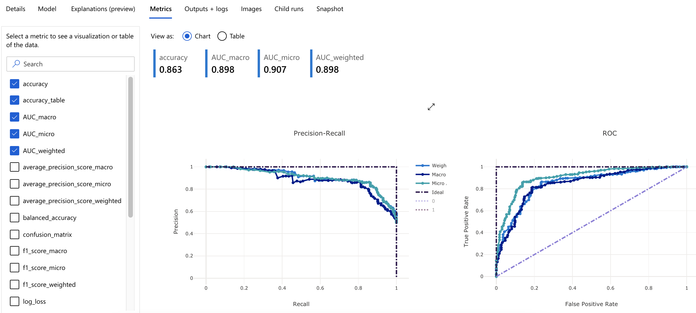
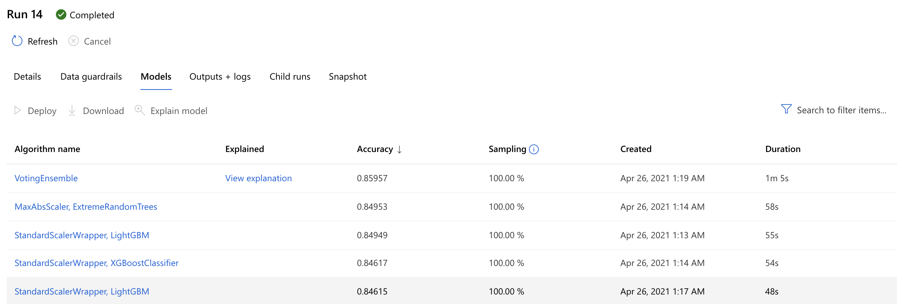

# Heart Failure Prediction using ML Azure

This project uses machine learning to predict mortality caused by heart failure. I used 2 different approaches to build and test ML models in Azure.
- Custom Model with best features using Hyperdrive: I used Logistic Regression algorithm and tuned it using Azure Hyperdrive and parameter sampler to get the best model hyperparameters.
- AutoML: Found the best model for this task using Azure's AutoML feature.

On comparing the performance of both the models, I found out that the Voting Ensemble model found using AutoML had the best performance. I then deployed this model and created a REST API endpoint, which was later consumed and tested.

## Dataset

### Overview
This dataset used in this project is taken from [Kaggle](https://www.kaggle.com/andrewmvd/heart-failure-clinical-data). It consists of 12 distinct features and 1 target as summarized below:
- **Input features** - Age, Anaemia, Creatinine-phosphokinase, Diabetes, Ejection_fraction, High_blood_pressure, Platelets, Serum_creatinine, Serum_sodium, Sex, Smoking, Time
- **Target** - DEATH_EVENT

The dataset profile is as shown below:


### Task
I used this dataset for training and testing the custom Logistic Regression model and also various AutoML models. The best fitted model was then used to predict mortality caused by heart failure.

### Access
I added the csv file containing the data in the project directory. Then I created a pandas dataframe to explore the data and split it into training and testing. I also used Azure datastore to register this dataset in Azure, so that I can graphically explore the data in ML Azure Studio.


## Automated ML
I used the following automl settings and configuration parameters:
```python
automl_settings = { "n_cross_validations": 2,
                    "primary_metric": 'accuracy',
                    "enable_early_stopping": True,
                    "max_concurrent_iterations": 4,
                    "experiment_timeout_minutes": 15,
                }

automl_config = AutoMLConfig(compute_target = compute_target,
                            task='classification',
                            training_data=heart_failure_ds,
                            label_column_name='DEATH_EVENT',
                            path = 'automl_runs',
                            featurization= 'auto',
                            debug_log = "automl_errors.log",
                            enable_onnx_compatible_models=True,
                            **automl_settings)
```
**AutoML Settings**
- *n_cross_validations*: I chose 2 cross validations, which means that the metrics are calculated as an average of 2 folds.
- *primary metric*: I chose `accuracy` as it is the default metric for classification tasks. 
- *enable_early_stopping*: I set this value to `True` so that the model can stop training once it stops improving.
- *max_concurrent_iterations*: This value is set at 4, which means that there can be at max 4 iterations in parallel.
- *experiment_timeout_minutes*: To save costs, I chose this value to be 15 mins. After this time the AutoML experiement will automatically stop.

**AutoML Config**
- *compute_target*: This defines the Azure Compute target that I set up for running this experiment.
- *task*: Since this is a classification problem, this value is set as `classification`.
- *training_data*: The training data used for this experiement. It contains both - training features and the target label.
- *label_column_name*: Target label column name, which is `DEATH_EVENT`.
- *path*: path to AzureML project folder.
- *featurization*: Setting this value to `auto` means that featurization will be done automatically.
- *debug_log*: path of the log file.
- *enable_onnx_compatible_models*: Setting this value to `True` enables `onnx_compatible_models`.


### Results
The best performing model using AutoML was "Voting Ensemble" with an Accuracy of 0.86293 and weighted AUC of 0.898. These metrics could be improved by trying different AutoML configurations and letting AutoML run for more time.



The top 5 AutoML models are as below:


Here is the screenshot of the `RunDetails` widget:


## Hyperparameter Tuning
I chose 


### Results
*TODO*: What are the results you got with your model? What were the parameters of the model? How could you have improved it?
I chose Logistic Regression classifier because it is a good machine learning model for univariate classification problems. The hyperparameters choices that were tested for this Logistic regression classifier were defined by the parameter sampler as shown below:
```python
ps = RandomParameterSampling(
    {
        '--C' : choice(0.01,0.1,1,10,100),
        '--max_iter': choice(50,100)
    }
)
```
Here, `C` is the regularization strength, and `max_iter` defines the total number of iterations. Some options available in the Azure sampling library are `RandomParameterSampling`, `GridParameterSampling`, `BayesianParameterSamping`, etc. Out of these, I used `RandomParameterSampling` as it is fast and supports early termination  for low-performance runs.

I got an accuracy of 0.83 with `C=1` and `max_iterations=50`.


Here is the output of the `RunDetails` widget:


## Model Deployment
*TODO*: Give an overview of the deployed model and instructions on how to query the endpoint with a sample input.

## Screen Recording
*TODO* Provide a link to a screen recording of the project in action. Remember that the screencast should demonstrate:
- A working model
- Demo of the deployed  model
- Demo of a sample request sent to the endpoint and its response

## Standout Suggestions
*TODO (Optional):* This is where you can provide information about any standout suggestions that you have attempted.
