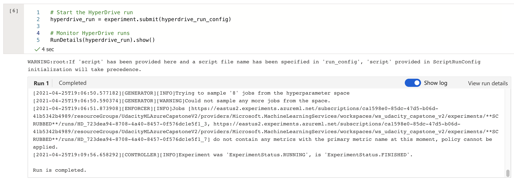
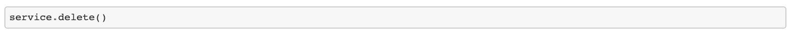

# Heart Failure Prediction using ML Azure

This project uses machine learning to predict mortality caused by heart failure. I used 2 different approaches to build and test ML models in Azure.
- Custom Model with best features using Hyperdrive: I used Logistic Regression algorithm and tuned it using Azure Hyperdrive and parameter sampler to get the best model hyperparameters.
- AutoML: Found the best model for this task using Azure's AutoML feature.

On comparing the performance of both the models, I found out that the Voting Ensemble model found using AutoML had the best performance. I then deployed this model and created a REST API endpoint, which was later consumed and tested.

## Dataset

### Overview
This dataset used in this project is taken from [Kaggle](https://www.kaggle.com/andrewmvd/heart-failure-clinical-data). It consists of 12 distinct features and 1 target as summarized below:
- **Input features** - Age, Anaemia, Creatinine-phosphokinase, Diabetes, Ejection_fraction, High_blood_pressure, Platelets, Serum_creatinine, Serum_sodium, Sex, Smoking, Time
- **Target** - DEATH_EVENT

The dataset profile is as shown below:


### Task
I used this dataset for training and testing the custom Logistic Regression model and also various AutoML models. The best fitted model was then used to predict mortality caused by heart failure.

### Access
I added the csv file containing the data in the project directory. Then I created a pandas dataframe to explore the data and split it into training and testing. I also used Azure datastore to register this dataset in Azure, so that I can graphically explore the data in ML Azure Studio.


## Automated ML
I used the following automl settings and configuration parameters:
```python
automl_settings = { "n_cross_validations": 2,
                    "primary_metric": 'accuracy',
                    "enable_early_stopping": True,
                    "max_concurrent_iterations": 4,
                    "experiment_timeout_minutes": 15,
                }

automl_config = AutoMLConfig(compute_target = compute_target,
                            task='classification',
                            training_data=heart_failure_ds,
                            label_column_name='DEATH_EVENT',
                            path = 'automl_runs',
                            featurization= 'auto',
                            debug_log = "automl_errors.log",
                            enable_onnx_compatible_models=True,
                            **automl_settings)
```
**AutoML Settings**
- *n_cross_validations*: I chose 2 cross validations, which means that the metrics are calculated as an average of 2 folds.
- *primary metric*: I chose `accuracy` as it is the default metric for classification tasks. 
- *enable_early_stopping*: I set this value to `True` so that the model can stop training once it stops improving.
- *max_concurrent_iterations*: This value is set at 4, which means that there can be at max 4 iterations in parallel.
- *experiment_timeout_minutes*: To save costs, I chose this value to be 15 mins. After this time the AutoML experiement will automatically stop.

**AutoML Config**
- *compute_target*: This defines the Azure Compute target that I set up for running this experiment.
- *task*: Since this is a classification problem, this value is set as `classification`.
- *training_data*: The training data used for this experiement. It contains both - training features and the target label.
- *label_column_name*: Target label column name, which is `DEATH_EVENT`.
- *path*: path to AzureML project folder.
- *featurization*: Setting this value to `auto` means that featurization will be done automatically.
- *debug_log*: path of the log file.
- *enable_onnx_compatible_models*: Setting this value to `True` enables `onnx_compatible_models`.

**Best AutoML model Parameters**

The parameters for the best fitted AutoML model can be printed using `print(fit_model)`, as I have done in `automl.ipynb`. The output is as follows:


### Results
The best performing model using AutoML was "Voting Ensemble" with an Accuracy of 0.853 and weighted AUC of 0.896. These metrics could be improved by trying different AutoML configurations and letting AutoML run for more time.


The top 5 AutoML models are as below:


Here is the screenshot of the `RunDetails` widget:


## Hyperdrive
I chose Logistic Regression classifier because it is a good machine learning model for univariate classification problems. The hyperparameters choices that were tested for this Logistic regression classifier were defined by the parameter sampler as shown below:

```python
ps = RandomParameterSampling(
    {
        '--C' : choice(0.01,0.1,1,10,100),
        '--max_iter': choice(50,100)
    }
)
```
Here, `C` is the regularization strength, and `max_iter` defines the total number of iterations. Some options available in the Azure sampling library are `RandomParameterSampling`, `GridParameterSampling`, `BayesianParameterSamping`, etc. Out of these, I used `RandomParameterSampling` as it is fast and supports early termination  for low-performance runs.

I got an accuracy of 0.83 with `C=1` and `max_iterations=50`.


Here is the output of the `RunDetails` widget showing that the Run is completed.


## Model Deployment
For deploying the model I first selected the registered model, which was the Voting Ensemble model from AutoML runs. Next, I prepared an inference config, entry script and selected a compute target for the inference run. Finally, I deployed the model using ACI web service and tested the REST API endpoint. Finally, I printed logs and deleted the service endpoint.

- *Registered Model* - Here you can see that the best HyperDrive and AutoML models are registered.


- *Inference and Deployment Config*


- Deployed model (Best AutoML) endpoint

  

- *Compose and send request* - This is done in the file `endpoint.py`. At first I set the values of `scoring_uri `and `key` to be the same as values showed in Azure console. Next, I created sample data for testing and converted it to a JSON string as follows:

  ```python
  data = {"data":
          [
            {
             "age": 61, 
             "anaemia": 0, 
             "creatinine_phosphokinase": 582, 
             "diabetes": 1, 
             "ejection_fraction": 20, 
             "high_blood_pressure": 1, 
             "platelets": 265000, 
             "serum_creatinine": 1.9, 
             "serum_sodium": 130, 
             "sex": 1, 
             "smoking": 0,
             "time": 4
            }
        ]
      }
  # Convert to JSON string
  input_data = json.dumps(data)
  with open("data.json", "w") as _f:
      _f.write(input_data)
  ```

  Then we set the content type:

  ```python
  # Set the content type
  headers = {'Content-Type': 'application/json'}
  # If authentication is enabled, set the authorization header
  headers['Authorization'] = f'Bearer {key}'
  ```

  Finally we make the request and print the response on screen:

  ```python
  # Make the request and display the response
  resp = requests.post(scoring_uri, input_data, headers=headers)
  print(resp.json())
  ```

- *Testing the endpoint*


- *Logs*


- *Deleting the service*


## Screen Recording
https://youtu.be/afsK0swzD5c

